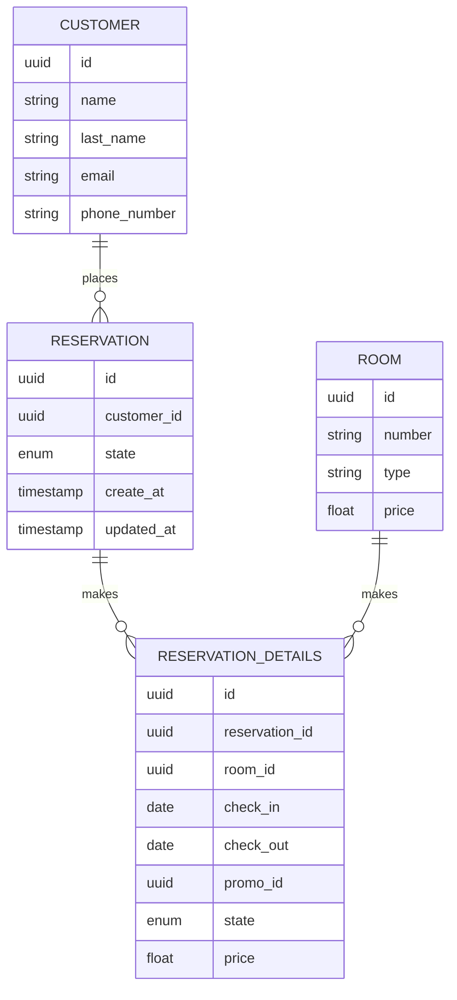

```mermaid
erDiagram
    CUSTOMER ||--o{ RESERVATION : places
    RESERVATION ||--o{ RESERVATION_DETAILS : makes
    ROOM ||--o{ RESERVATION_DETAILS : makes

    CUSTOMER {
        uuid id
        string name
        string last_name
        string email
        string phone_number
    }

    ROOM {
        uuid id
        string number
        string type
        float price
    }

    RESERVATION {
        uuid id
        uuid customer_id
        enum state
        timestamp create_at
        timestamp updated_at
    }

    RESERVATION_DETAILS {
        uuid id
        uuid reservation_id
        uuid room_id
        date check_in
        date check_out
        uuid promo_id
        enum state
        float price
    }
```
