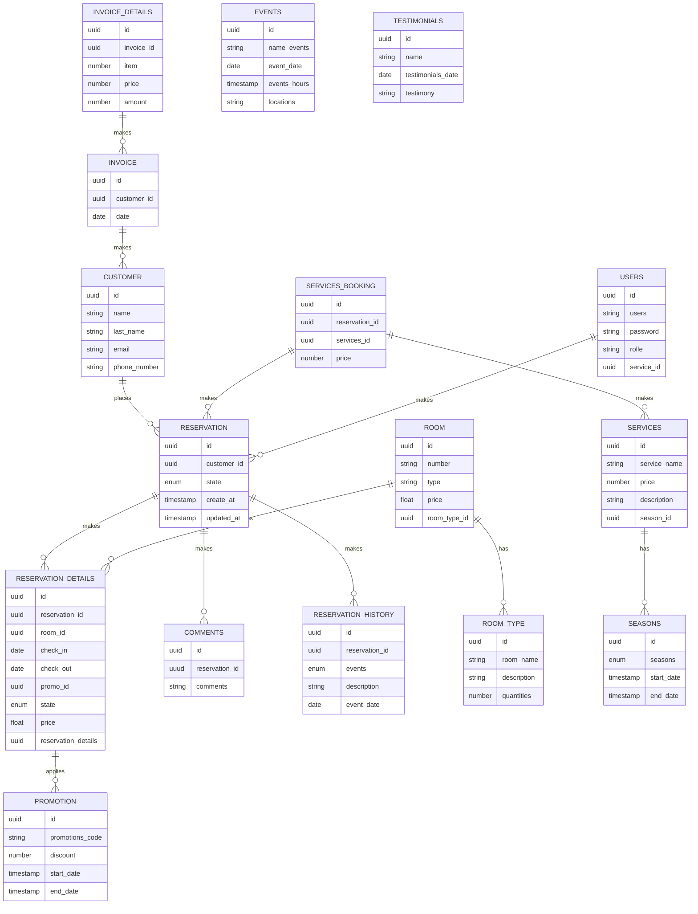

```mermaid
erDiagram
    CUSTOMER ||--o{ RESERVATION : places
    RESERVATION ||--o{ RESERVATION_DETAILS : makes
    ROOM ||--o{ RESERVATION_DETAILS : makes
    RESERVATION ||--o{ COMMENTS : makes
    RESERVATION ||--o{ RESERVATION_HISTORY  : makes
    SERVICES_BOOKING ||--o{ RESERVATION  : makes
    SERVICES_BOOKING ||--o{ SERVICES  : makes
    INVOICE ||--o{ CUSTOMER  : makes
    INVOICE_DETAILS ||--o{ INVOICE  : makes
    ROOM ||--o{ ROOM_TYPE : has
    SERVICES ||--o{ SEASONS : has
    USERS ||--o{ RESERVATION : makes
    RESERVATION_DETAILS ||--o{ PROMOTION : applies
  


    CUSTOMER {
        uuid id
        string name
        string last_name
        string email
        string phone_number
    }

    ROOM {
        uuid id
        string number
        string type
        float price
        uuid room_type_id
    }

    RESERVATION {
        uuid id
        uuid customer_id
        enum state
        timestamp create_at
        timestamp updated_at
    }

    RESERVATION_DETAILS {
        uuid id
        uuid reservation_id
        uuid room_id
        date check_in
        date check_out
        uuid promo_id
        enum state
        float price
        uuid reservation_details
    }

    COMMENTS {
        uuid id
        uuud reservation_id
        string comments

    }

    EVENTS {
        uuid id
        string name_events
        date event_date
        timestamp events_hours
        string locations
    }

    USERS {
        uuid id
        string users
        string password
        string rolle
        uuid service_id
    }
    
    TESTIMONIALS {
        uuid id
        string name
        date testimonials_date
        string testimony
    }

    ROOM_TYPE {
        uuid id
        string room_name
        string description
        number quantities
    }

    RESERVATION_HISTORY {
        uuid id
        uuid reservation_id
        enum events
        string description
        date event_date
    }

    PROMOTION {
        uuid id
        string promotions_code
        number discount
        timestamp start_date
        timestamp end_date
    }

    SERVICES {
        uuid id
        string service_name
        number price
        string description
        uuid season_id
    }

    SEASONS {
        uuid id
        enum seasons
        timestamp start_date
        timestamp end_date
    }

    SERVICES_BOOKING {
        uuid id
        uuid reservation_id
        uuid services_id
        number price
    }

    INVOICE {
        uuid id
        uuid customer_id
        date date
    }

    INVOICE_DETAILS {
        uuid id
        uuid invoice_id
        number item
        number price
        number amount
    }

```
